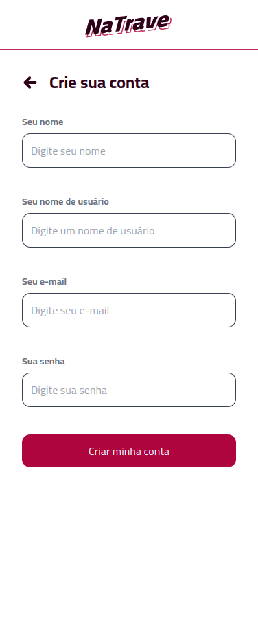
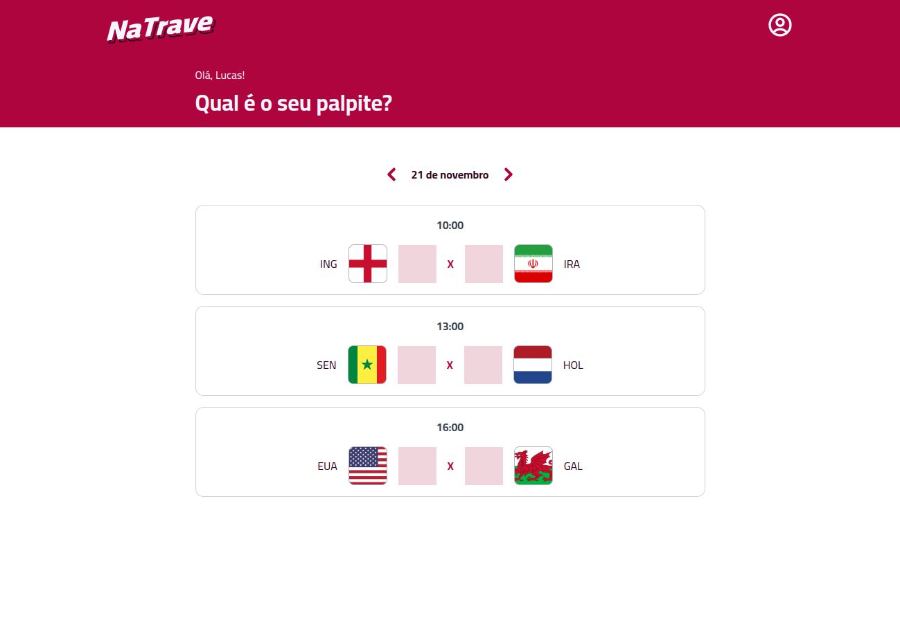
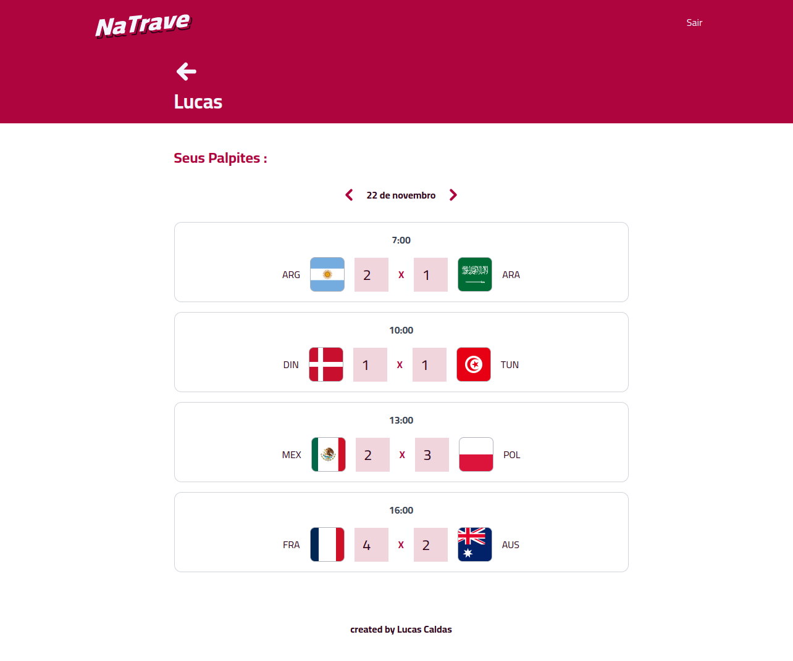

# NaTrave API

Projeto desenvolvido no evento Full Stack Challange da Codar.me

[Clique aqui para acessar]()

## Tecnologias

- Nodejs
- MySQL
- Prisma
- Koa
- Bcrypt
- Date-fns
- JWT
- Dotenv-safe

## Contato

lucas20caldas@gmail.com
